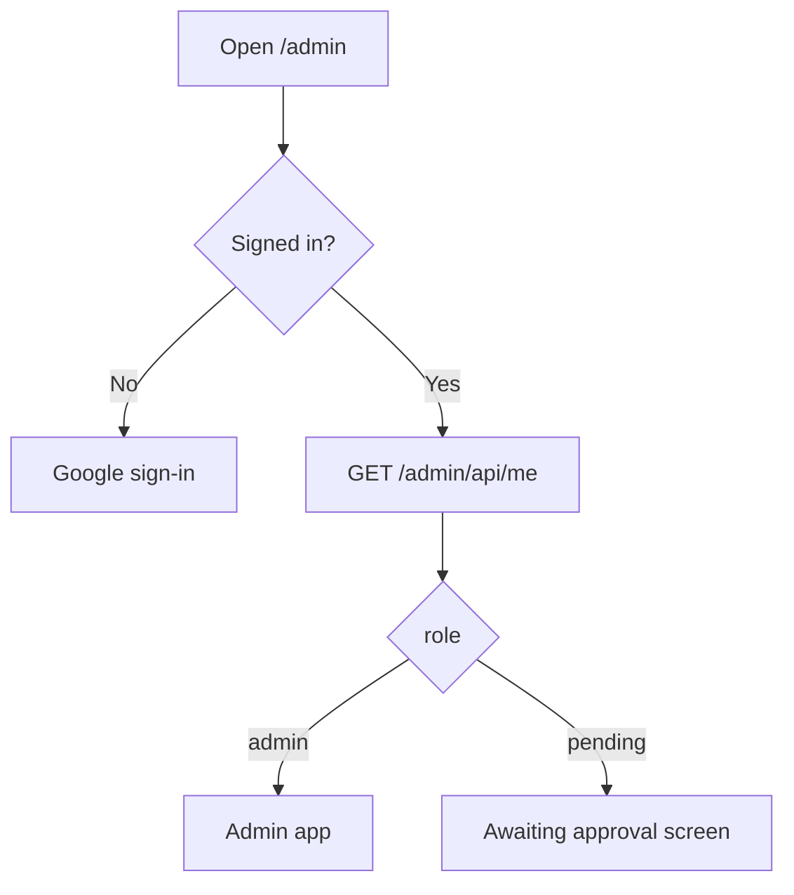

# Admin Control Dashboard

A standalone, Firebase-Auth-gated web app for managing the AI system and testing prompt changes. It is **not** embedded in Chatwoot — it's a separate SPA in [`admin-web/`](../admin-web/) served by the same Express server at **`/admin`**, backed by protected APIs under `/admin/api`.

## Features (v1)

1. **Settings** — live-edit every AI system prompt (draft, responder, classifier, summary, matcher, holding), per-task models, the auto-respond vs escalate routing labels, the holding-reply toggle, and numeric knobs (max tokens / iterations). Overrides are stored in Firestore and applied without a redeploy.
2. **Prompt Tester** — enter a Chatwoot conversation ID and reproduce a draft/response **exactly** as the system would generate it, with no side effects. See the full context the AI receives, the exact final system + user prompt, the messages/images, and the output. Optionally test with your unsaved editor values before saving.
3. **Users** — Google sign-in for anyone; access requires an `admin` role granted from this page (manual approval).

Built modular and expandable — future pages (e.g. AI Usage Reports from the `aiUsage` audit log) drop in as new routes.

## Config overrides with fallback ([`src/services/appConfig.ts`](../src/services/appConfig.ts))

A single accessor, `getAiConfig()`, returns the shipped defaults overlaid with any Firestore overrides from `systemConfig/ai`, cached in-memory with a short TTL (~30s) and invalidated immediately on save.

- **Fallback only on a problem:** any field that is unset/empty — or any Firestore error — resolves to the current default (env var, prompt file, or hardcoded constant). With no config doc present, behaviour is byte-for-byte identical to before.
- **History:** every save appends the prior config to `systemConfig/ai/versions` with `updatedBy` + `recordedAt` for audit/rollback.

Managed fields:

- **Prompts:** `draftSystemPrompt`, `responderSystemPrompt`, `classifierSystemPrompt`, `summarySystemPrompt`, `resolverSystemPromptTemplate` (uses `{{email}}`), `holdingSystemPrompt`.
- **Models:** `draftModel`, `responderModel`, `classifierModel`, `summaryModel`, `resolverModel`, `holdingModel`.
- **Routing:** `autoRespondLabels` (live), `backfillAutoRespondLabels`, `holdingReplyEnabled`.
- **Numeric:** `draftMaxTokens`, `classifierMaxTokens`, `summaryMaxTokens`, `holdingMaxTokens`, `responderMaxTokens`, `responderMaxIterations`, `resolverMaxTokens`, `resolverMaxIterations`.

## Prompt tester / replay ([`src/services/aiReplay.ts`](../src/services/aiReplay.ts))

Reproduces generation for a conversation with all writes disabled:

- Resolves `contactId`/`email` from the conversation, gathers context (Shopify match runs in a `dryRun` mode that skips the `shopify_email_link` write and the negative-match cache write), builds the final system + user prompt and images, and runs Claude.
- **Skipped side effects:** posting private notes, storing drafts, writing labels, linking emails, negative-cache writes, summary refresh, sending replies, or status changes.
- **Paths:** `draft` (full fidelity — the primary case), `classifier` (labels + reasoning + exact prompt, no label writes), and `responder` (exact prompt + routing decision + generated text via stubbed no-op tools).
- Optionally merges **unsaved editor overrides** from the request so you can preview a prompt change before saving it.

The response returns everything needed for the debug view: the resolved context object, the final `systemPrompt`, the final `userPrompt`, the message array (with image count), the model + params, and the output.

## Auth & approval

- **Frontend:** Firebase Web SDK, Google sign-in. The client sends the Firebase ID token as `Authorization: Bearer <token>` on every `/admin/api` call.
- **Backend:** [`src/middleware/adminAuth.ts`](../src/middleware/adminAuth.ts) verifies the ID token (via the same firebase-admin app used for Firestore) and checks authorization:
  - `requireAuth` — valid token; upserts a `pending` user doc on first sight. Used by `GET /admin/api/me`.
  - `requireAdmin` — valid token **and** admin role; 403 otherwise. Used by everything else.
- **Roles:** stored in `users/{uid}` (`role: 'admin' | 'pending'`). Emails listed in `ADMIN_BOOTSTRAP_EMAILS` always count as admin — this bootstraps the first admin, who can then approve others from the Users page.



Authorization is entirely server-side — the browser uses Firebase only to obtain an auth token, and all data flows through `/admin/api`, so no client-side Firestore security rules are required.

## API

| Method | Path | Auth | Purpose |
|--------|------|------|---------|
| `GET` | `/admin/api/me` | any signed-in | Current user `{ email, role }` |
| `GET` | `/admin/api/config` | admin | Merged config + which fields are overridden + defaults |
| `PUT` | `/admin/api/config` | admin | Save overrides (records `updatedBy`, appends version, invalidates cache) |
| `GET` | `/admin/api/config/history` | admin | Config version history |
| `GET` | `/admin/api/users` | admin | List users |
| `POST` | `/admin/api/users/:uid/role` | admin | Grant/revoke admin |
| `POST` | `/admin/api/replay` | admin | Side-effect-free prompt/response replay |

## Local development

```bash
cd admin-web
npm install
npm run dev
```

For production it's built to `admin-web/dist` and served by Express at `/admin`; the root `npm run build` builds it automatically. Configure the `VITE_FIREBASE_*` build vars and `ADMIN_BOOTSTRAP_EMAILS` — see [configuration.md](configuration.md).
