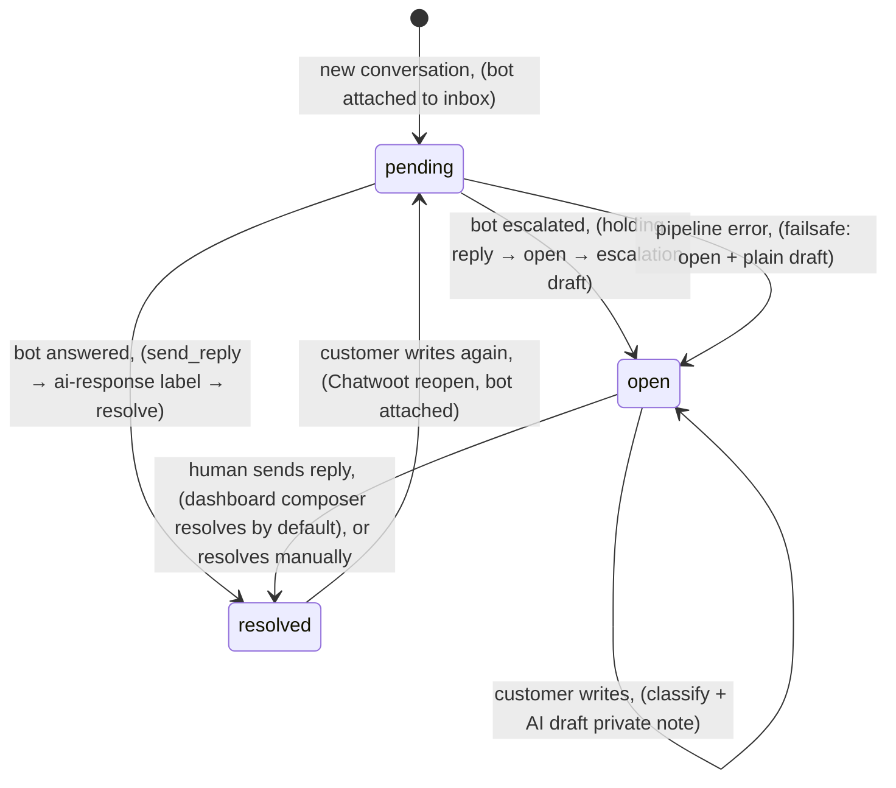
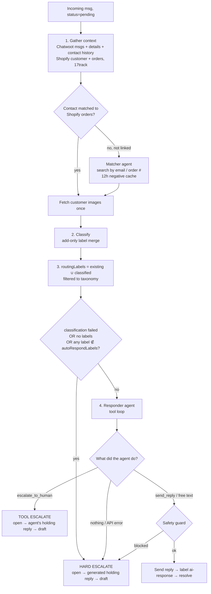

# AI AgentBot: Auto-Responder & Human Handoff

An autonomous Chatwoot AgentBot that takes first ownership of every new customer conversation. For each incoming message it **classifies + labels** the conversation, **auto-responds** to the narrow set of cases it can safely handle (subscription cancellation, order status), and **hands everything else to a human** with a holding reply and a ready-made draft.

Orchestration lives in [`src/services/aiResponder.ts`](../src/services/aiResponder.ts). This document describes exactly how it behaves today, including its failure modes and known gaps ([§9](#9-known-gaps--risks)).

- [1. The core idea: Chatwoot status = who owns the conversation](#1-the-core-idea-chatwoot-status--who-owns-the-conversation)
- [2. Conversation lifecycle (AI ⇄ human)](#2-conversation-lifecycle-ai--human)
- [3. Entry: the two webhooks](#3-entry-the-two-webhooks)
- [4. The AgentBot pipeline, step by step](#4-the-agentbot-pipeline-step-by-step)
- [5. Routing rules: when does it answer?](#5-routing-rules-when-does-it-answer)
- [6. The responder agent: how does it answer?](#6-the-responder-agent-how-does-it-answer)
- [7. Human handoff (escalation)](#7-human-handoff-escalation)
- [8. Failure handling & what keeps it safe](#8-failure-handling--what-keeps-it-safe)
- [9. Known gaps & risks](#9-known-gaps--risks)
- [10. Configuration, observability & testing](#10-configuration-observability--testing)
- [11. One-time backfill](#11-one-time-backfill)
- [12. Chatwoot setup](#12-chatwoot-setup)

---

## 1. The core idea: Chatwoot status = who owns the conversation

There is **no ownership field of our own**. The system uses Chatwoot's built-in conversation status as the ownership flag:

| Status | Owner | What handles new customer messages |
|--------|-------|-------------------------------------|
| `pending` | **AI bot** | AgentBot webhook → classify → auto-respond or escalate |
| `open` | **Human** | Draft webhook → classify + AI draft as a private note |
| `resolved` | Nobody | Chatwoot reopens it on the next customer message (see below) |

Every transition between AI and human is just a status change:

- **AI → human:** the bot calls `toggle_status` → `open` ([`chatwootConversation.ts`](../src/services/chatwootConversation.ts) `setConversationStatus`).
- **AI done:** the bot calls `toggle_status` → `resolved`.
- **Human → AI:** there is **no explicit handback**. The only path back to the bot is: a human (or the bot) resolves the conversation, the customer writes again, and Chatwoot reopens it as `pending`.

### Chatwoot behaviour this relies on

These are Chatwoot-side behaviours, not code in this repo:

1. When an inbox has an active AgentBot, **new conversations are created as `pending`**.
2. When a customer messages a **resolved** conversation in an inbox with an active bot, Chatwoot **reopens it as `pending`** (without a bot it reopens as `open`).
3. Chatwoot sends `message_created` to the AgentBot URL **and** to the account webhook (`/chatwoot`) for every message, including our own outgoing ones; filtering is our job.
4. If the AgentBot URL errors or takes longer than ~5s, Chatwoot flips the conversation to `open` and posts a bot-error activity. Our route acks `200` immediately to avoid that.

> In the Chatwoot UI, `pending` conversations live under the **Pending** filter, not the default **Open** view. A conversation stuck in `pending` is effectively invisible to agents (see [§9](#9-known-gaps--risks)).

---

## 2. Conversation lifecycle (AI ⇄ human)



Walking through the common journeys:

**A. Clean order-status question.** Customer: "Where is my order?" → conversation created `pending` → classified `order-status` → responder sends reply → label `ai-response` → `resolved`. If the customer replies "thanks", Chatwoot reopens as `pending` and the bot runs again on the whole thread.

**B. Subscription cancellation, two turns.** Customer: "Cancel my subscription" → `sub-cancel` → responder sends the self-service link (Step 1) → `resolved`. Customer: "Just do it for me please" → reopened `pending` → bot sees its earlier link in the thread → calls `cancel_subscription` (Skio) → label `sub-cancelled-ai` → confirms via `send_reply` → `resolved`.

**C. Refund request.** Customer: "I want a refund" → classified `refund` (not auto-respondable) → **hard escalation**: holding reply → `open` → escalation draft posted as a private note. From here on every customer message is drafted for the human. The bot does not see this conversation again until it is resolved and the customer writes again, and even then the sticky `refund` label escalates it immediately ([§5](#sticky-labels)).

**D. Looked simple, wasn't.** Customer: "Where's my order?" but the order is refunded → classified `order-status` → responder runs, sees `REFUNDED` in ORDER HISTORY → calls `escalate_to_human` itself (**tool escalation**) → holding reply (written by the agent) → `open` → escalation draft.

---

## 3. Entry: the two webhooks

Both routes receive every `message_created` event and act on disjoint statuses, so a message is never handled by both.

| | AgentBot | Draft |
|---|---|---|
| Endpoint | `POST /chatwoot/agent-bot` ([`agentBotWebhook.ts`](../src/routes/agentBotWebhook.ts)) | `POST /chatwoot` ([`chatwootWebhook.ts`](../src/routes/chatwootWebhook.ts)) |
| Registered in Chatwoot as | Settings → Bots (Agent Bot outgoing URL) | Settings → Integrations → Webhooks |
| Secret | `?secret=` = `CHATWOOT_AGENT_BOT_SECRET` (if set) | `?secret=` = `CHATWOOT_WEBHOOK_SECRET` (if set) |
| Acts when `conversation.status` is | `pending` only | anything **except** `pending` |
| Does | `handleAgentBotMessage` → full pipeline | `postAiDraft({ classify: true })` |
| Idempotency key | `wh-agentbot:<message id>`, 24h | `wh-draft:<message id>`, 24h |

Shared gate (both routes), in order:

1. Respond `200 { received: true }` **immediately**; everything after is async and fire-and-forget.
2. Reject silently (log only) on a wrong secret.
3. Require `event === 'message_created'`, `message_type === 'incoming'`, `private !== true`. This drops our own outgoing replies, private notes, and activity messages.
4. Status filter (table above).
5. `claimOnce(namespace, messageId)` in Firestore. A redelivery of the same message is skipped. **Fail-open:** without Firestore, or on a Firestore error, the claim always succeeds.

Mount order matters: `/chatwoot/agent-bot` is mounted before `/chatwoot` in [`src/app.ts`](../src/app.ts).

---

## 4. The AgentBot pipeline, step by step

`processAgentBotConversation()` ([`aiResponder.ts`](../src/services/aiResponder.ts)), for one incoming message on a `pending` conversation:



### Step 1: context ([`aiDraft.ts`](../src/services/aiDraft.ts) `gatherContextWithMatching`)

The same context builder the human drafts use:

- **Chatwoot** (parallel): current conversation messages, conversation details (contact custom attributes, email subject), the contact's other conversations.
- **Shopify lookup precedence:** `shopify_email_link` contact attribute → `shopify_customer_id` attribute → contact email.
- **Matcher agent** ([`customerResolver.ts`](../src/services/customerResolver.ts)): runs only when there are no orders and no `shopify_email_link`. It looks for an alternate email or order number in the message/subject and, on a match, writes `shopify_email_link` back to the contact. A no-match result is cached for 12h per contact + message hash.
- **Tracking:** 17track status for tracking numbers on the last 2 fulfilled orders.
- If there are still no orders, a `--- CUSTOMER NOT MATCHED ---` guidance block is added.
- **Customer images** (attachments + inline email images, max 6) are fetched **once** and shared by the classifier, the responder and any escalation draft. In `dryRun` mode the matcher never writes `shopify_email_link`.

The prompt ([`promptBuilder.ts`](../src/utils/promptBuilder.ts)) contains: today's date, customer line (name, email, new vs ongoing, order count, LTV, address), `--- ORDER HISTORY ---` (with `REFUNDED`/`CANCELLED`/`VOIDED` flags and a "never fulfilled, do not say it's on its way" note), `--- TRACKING ---`, `--- CURRENT CONVERSATION ---` (customer and agent messages only; private notes and activity messages are excluded), and `--- PREVIOUS CONVERSATIONS ---` (last 5, first 10 messages each).

### Step 2: classification ([`classifier.ts`](../src/services/classifier.ts))

- Model: `classifierModel` (default `CLAUDE_CLASSIFIER_MODEL` → `claude-sonnet-5`), adaptive thinking at `classifierEffort` (`medium`), structured output `{ reasoning, labels[] }`, labels constrained to the enum below.
- Input: the prompt above, `Labels already on this conversation: …`, and customer images.
- Prompt rules weigh the **latest** customer message most heavily, and treat acknowledgements ("thanks") and auto-replies as no new intent.
- Returns `null` on API error, refusal, or parse failure.
- Labels are written **add-only**: read current → union → write back (Chatwoot's label endpoint replaces the set). Never removed.
- The decision is saved to Firestore `classifications/<conversationId>` (latest only).

**Classification labels** (AI-assignable):

| Label | Meaning | Auto-respondable by default |
|-------|---------|:---:|
| `sub-cancel` | Stop subscription / future rebills | ✅ |
| `order-status` | Where is my order / delayed / when arrives | ✅ |
| `other` | Anything that fits nothing else | ✅ (but the responder is told to escalate it) |
| `refund` | Refund, return, cancel/undo an order | ❌ |
| `business` | Partnerships, wholesale, press | ❌ |
| `change-address` | Change delivery address | ❌ |
| `change-contact` | Change email/phone | ❌ |
| `discount-issue` | Discount code problems | ❌ |
| `missing-packs` | Delivered order missing packs | ❌ |
| `no-country` | Ordered to a non-shippable country | ❌ |
| `not-delivered` | Tracking says delivered, customer didn't receive | ❌ |
| `product-defect` | Gum/packaging defect | ❌ |

**Action labels** record what was done and are never assigned by the classifier: `ai-response` (bot answered), `sub-cancelled-ai` (bot cancelled in Skio), `sub-cancelled` (human cancelled via dashboard), plus human-applied `refund-30/50/70/full`, `reshipped`, `changed-address`, `changed-contact`.

---

## 5. Routing rules: when does it answer?

After classification, `routingLabels` = **all labels currently on the conversation ∪ newly classified**, filtered to the classification taxonomy (action labels are ignored).

The conversation is **hard-escalated** (no responder call) if **any** of:

1. classification returned `null` (API error / refusal / parse failure),
2. `routingLabels` is empty,
3. **any** routing label is outside `autoRespondLabels` (default `sub-cancel`, `order-status`, `other`).

Otherwise the responder agent runs. The responder can still escalate on its own ([§6](#6-the-responder-agent-how-does-it-answer)).

| Labels | Result |
|--------|--------|
| `order-status` | responder |
| `sub-cancel` | responder (with `cancel_subscription` tool) |
| `sub-cancel` + `order-status` | responder, both handled in one reply |
| `other` | responder, which is instructed to escalate everything outside the two cases, so in practice an agent-written holding reply |
| `sub-cancel` + `refund` | hard escalate |
| anything containing a ❌ label | hard escalate |

### Sticky labels

Because labels are add-only and routing uses the **union with existing labels**, a conversation that has *ever* carried a non-auto label (e.g. `refund` two weeks ago) is hard-escalated on **every future message in that conversation**, even after it was resolved and the new message is a simple "where is my order?". This is deliberately conservative, but it also means the bot never gets such a conversation back. Labels on the contact's *other* conversations don't affect routing.

`autoRespondLabels` is live-editable in the [Admin Dashboard](admin-dashboard.md) (Settings → routing).

---

## 6. The responder agent: how does it answer?

`runResponderAgent()` runs the Anthropic **Tool Runner** (`client.beta.messages.toolRunner`):

- Model: `responderModel` (default `CLAUDE_MODEL` → `claude-sonnet-5`), adaptive thinking at `responderEffort` (`high`), `responderMaxTokens` 8000, `responderMaxIterations` 5.
- `tool_choice: auto` with **`disable_parallel_tool_use`**: one tool call per turn, so the agent can't confirm a cancellation in the same turn it requests it.
- System prompt: `responderSystemPrompt` (default [`responderPrompt.txt`](../src/config/responderPrompt.txt)), sent as a cached block.
- One user message: the prompt from step 1 plus customer images.

### Tools

| Tool | Available | What it does |
|------|-----------|--------------|
| `send_reply(message)` | always | Stores `message` as the pending reply. **Nothing is sent inside the loop.** The message goes out after the loop ends, so a run can produce at most one answer. If called twice, the last call wins. |
| `escalate_to_human(reason, holding_reply)` | always | Records the escalation request. The handoff runs **after the loop** ([§7](#7-human-handoff-escalation)) and overrides any `send_reply`. If the loop errors after this call, the agent's holding reply is still used. |
| `cancel_subscription()` | only if `sub-cancel` ∈ routing labels | Cancels **all** active Skio subscriptions for `ctx.customerEmail` (the linked Shopify email if any, else the contact email), adds `sub-cancelled-ai`, and tells the agent to confirm via `send_reply`. Returns guidance strings for "no email", "no active subscription", and failures. |

### The playbook ([`responderPrompt.txt`](../src/config/responderPrompt.txt))

- **Scope:** only subscription cancellation and order status. Everything else, or any doubt, gets escalated.
- **Case 1, sub-cancel:**
  - *Step 1 (default):* send the self-service link only. Don't offer to do it.
  - *Step 2:* call `cancel_subscription` only if we already sent the link earlier in this conversation and they insist, or they explicitly refuse to use the website / can't access it.
- **Case 2, order-status:**
  - Order refunded/voided/cancelled (or unclear partial refund) → escalate.
  - No tracking yet → reassure, blame high demand, tracking email coming soon.
  - In transit → shipped, check inbox/spam for tracking, don't paste the link unless asked.
  - Tracking says delivered but not received → escalate.
  - Customer pushing for compensation → escalate.
- **Always escalate:** refund/return/order cancel (even combined), any other topic, the issue changing mid-conversation, anger/threats (chargeback, legal, review), asking for a human, low confidence.
- **Style:** English only, greet by name, no sign-off (the system appends `Kind regards,\nScandi Support Team`), no em dashes, never reveal AI, never say "China", never invent facts, never promise refunds/discounts.

### After the loop

1. Loop threw → escalate (with the agent's holding reply if it had already called `escalate_to_human`).
2. Escalation requested → escalate with the agent's holding reply. Result: `escalated`, reason `agent: <reason>`.
3. Candidate reply = the `send_reply` message, or the final turn's free text as a fallback.
4. Empty candidate → hard escalate (`no final reply produced`).
5. **Safety guard** ([§8](#reply-safety-guard)). Blocked → hard escalate. Preamble stripped or free-text fallback used → allowed, but logged as a guard event.
6. `sendReply` (public message). If sending fails → hard escalate.
7. Once the reply is sent, bookkeeping can't escalate: add `ai-response`, record in `sentReplies` (`source: agent-bot`), resolve (a resolve failure is only logged). Result: `responded`.

Every run's final result is saved to `agentBotDecisions/<conversationId>` (latest only) with `action` and a `reason` (why it escalated/skipped/failed; `null` when answered).

---

## 7. Human handoff (escalation)

There are two escalation paths. Both go through `escalateToHuman()`, which runs three **independent** steps in this order:

```
1. toggle_status → open                          ← the actual handoff, first, so it can't get stuck
2. (if holdingReplyEnabled) send a holding reply to the customer
3. postAiDraft({ escalation: true, context, images })  ← draft for the human, reusing the bot's context
```

A failure in one step is logged and doesn't stop the next.

| | Hard escalation (`hardEscalate`) | Tool escalation (`escalate_to_human`) |
|---|---|---|
| Triggered by | routing rules, empty responder prompt, no reply, guard block, responder error | the responder agent's own judgement |
| Holding reply written by | a separate call (`holdingSystemPrompt`, `holdingModel`, `holdingEffort` `low`) | the responder agent (`holding_reply` arg) |
| Holding reply vetting | `vetHoldingReply`; on failure (or empty generation) uses the canned fallback | same |
| Reason recorded | `agentBotDecisions.reason` + log | `agentBotDecisions.reason` (`agent: …`) + log |

**Canned fallback:** `Hi <name|there>, Thanks for reaching out! We need a bit of extra help to resolve this for you, so one of our team members will be in touch shortly to take care of everything.` plus the signature.

**`holdingReplyEnabled = false`:** step 1 is skipped. The customer gets nothing and the conversation silently becomes `open`.

### What the human gets

- The conversation appears in **Open** with the classification labels already applied.
- A private note with the escalation draft. `postAiDraft` reuses the context and images the bot already gathered and adds a `--- JUST ESCALATED ---` block ("the customer already got a holding reply; write the substantive next reply"). The note shows `[CUSTOMER MESSAGE — TRANSLATED]` (if non-English), the reply, and `[NOTE TO AGENT]`. It is also stored in Firestore `aiDrafts` and surfaced in the Dashboard App composer, and the customer summary is refreshed.
- **Not included in Chatwoot:** the escalation *reason* (Firestore only), the classifier reasoning, an assignee/team, or an "escalated" label.

### While a human owns it

Each new customer message on the `open` conversation goes through the draft webhook: classify + add labels, then a fresh AI draft private note. The bot never replies to `open` conversations. When the agent sends from the Dashboard composer (`POST /app/api/draft/send`), the conversation is **resolved by default** (`resolve: false` keeps it open), which re-arms the bot for the customer's next message.

---

## 8. Failure handling & what keeps it safe

### Safety mechanisms in place

| Mechanism | Where | Protects against |
|-----------|-------|------------------|
| Status split (`pending` vs rest) | both routes | bot and draft handling the same message |
| Incoming/non-private filter | both routes | replying to our own messages / notes |
| Idempotency claim per message id | `claimOnce` | Chatwoot redelivering one message |
| Immediate `200` ack | both routes | Chatwoot's 5s bot timeout flipping to `open` |
| Constrained label enum + escalate on `null` | classifier | hallucinated labels, classifier outages |
| `open` before holding reply, independent steps | `escalateToHuman` | escalations stuck in `pending` |
| Failsafe on pipeline error | `handleAgentBotMessage` | crashes leaving a conversation unseen |
| One tool call per turn | responder `tool_choice` | "I've cancelled it" sent before the cancellation result |
| Allow-list routing (`autoRespondLabels`) | `processAgentBotConversation` | auto-answering sensitive topics |
| Sticky labels | union routing | re-auto-answering a conversation that once needed a human |
| `cancel_subscription` only with `sub-cancel` | tool list | cancellation outside a cancel request |
| Deferred single send | `send_reply` stores, sends after loop | two answers per run |
| Escalation overrides reply | `escalated` checked first | answer + holding reply in one run |
| Reply safety guard | [`responderFormat.ts`](../src/utils/responderFormat.ts) | reasoning / scaffolding / AI disclosure leaking |
| Refund/cancel flags in prompt | `promptBuilder` | "your refunded order is on its way" |
| Activity messages excluded from prompt | `promptBuilder` | "Scandi added refund" read as a promise |

### Reply safety guard

Every model-authored text sent to a customer (responder reply, agent `holding_reply`, generated holding reply) is vetted deterministically. This exists because of conversation **#7775**, where the agent's reasoning ("order status is Case 2… so I send the self-service link only") was delivered above an otherwise correct reply.

1. **Preamble strip:** if internal markers appear *before* a greeting line (`Hi|Hello|Hey|Dear|Good morning…`), everything above the greeting is dropped.
2. **Marker scan** on the remainder. Marker ids: `deliberation`, `third-person-customer`, `playbook-reference` (`Case 1`, `Step 2`, "my instructions"), `pipeline-vocabulary` (escalate, classify, tool and label names), `agent-note`, `prompt-scaffolding` (`--- ORDER HISTORY`…), `ai-self-disclosure`, `tool-talk`.
3. **Fail closed:** a responder reply that still trips any marker is **never sent**; the conversation is hard-escalated. A failing holding reply is swapped for the canned fallback.
4. Trailing sign-offs are stripped and the fixed signature appended.

The guard is intentionally broad: a false positive costs one escalation, a false negative leaks. Interventions are logged to `responderGuardEvents` with outcome `blocked` | `preamble-stripped` | `missing-send-reply-tool` | `holding-fallback`, and the blocked text is stored for prompt debugging.

### What happens when something breaks

| Failure | Outcome |
|---------|---------|
| Classifier API error/refusal | `null` → hard escalate ✅ |
| Responder API error / max iterations / exception | hard escalate ✅ |
| Holding-reply generation fails | canned fallback sent ✅ |
| Guard blocks reply | hard escalate ✅ |
| Skio cancellation fails | tool tells agent to escalate (agent-dependent) ⚠️ |
| Chatwoot/Shopify error while gathering context (step 1) | failsafe: set `open`, try a plain draft, decision `failed` ✅ (customer gets no reply) |
| Holding reply fails to send during escalation | conversation is already `open`; draft still posted ✅ |
| Reply fails to send | hard escalate ✅ |
| Label/resolve fails after the reply was sent | logged only; no contradictory holding reply ✅ |
| Server restart / deploy mid-run | in-flight async work lost; message already claimed → **stays `pending`** ❌ |
| Firestore down | idempotency fails open (duplicates possible), config falls back to defaults, audit is silent ⚠️ |

---

## 9. Known gaps & risks

Remaining after the September 2026 reliability pass. Fixed in that pass: escalations stuck in `pending` (handoff now opens first, with a pipeline failsafe); a holding reply following a real answer; parallel tool calls; no escalation reason; bot replies missing from `sentReplies`; responder usage only counting the last turn; text-only classifier/responder; duplicate context gathering for escalation drafts; the matcher writing contact links during `--dry-run`; and the inconsistent cancel link.

1. **Concurrent messages race.** Idempotency is per *message*, not per *conversation*. Two customer messages seconds apart start two parallel pipelines, which can both reply or both escalate. *Fix direction:* a per-conversation lock/debounce, and re-checking status before acting.
2. **Restart mid-run still strands a conversation in `pending`.** The idempotency claim is taken before processing and nothing sweeps old `pending` conversations. *Fix direction:* a periodic sweeper for `pending` conversations with no bot reply after N minutes.
3. **Reply loops with auto-responders.** Bot resolves → out-of-office email → reopened `pending` → bot answers again. The classifier now treats auto-replies as no new intent, but there is still no per-conversation cap on bot replies.
4. **`other` is auto-respondable, but the responder is told to escalate it.** Most `other` tickets pay for a responder loop just to produce a holding reply.
5. **The human gets no "why" in Chatwoot.** The reason lives in Firestore only; there's no escalated label, assignee, or team.
6. **No explicit human → AI handback.** Resolve + customer reply is the only path, and sticky labels mean most escalated conversations never come back.
7. **English-only replies** from the responder and holding prompts.
8. **Two personas:** bot messages are signed "Scandi Support Team", human drafts use "Andrew".
9. **History is overwritten.** `agentBotDecisions` and `classifications` keep only the latest doc per conversation.

---

## 10. Configuration, observability & testing

### Config (live via Admin Dashboard, fallback to env/files)

| Setting | Default | Effect |
|---------|---------|--------|
| `responderSystemPrompt` | `responderPrompt.txt` / `CLAUDE_RESPONDER_PROMPT` | The playbook. Empty → every eligible conversation hard-escalates |
| `responderModel` / `responderEffort` | `CLAUDE_MODEL` (`claude-sonnet-5`) / `high` | Responder agent |
| `responderMaxTokens` / `responderMaxIterations` | 8000 / 5 | Tool-loop limits (tokens include thinking) |
| `classifierSystemPrompt` / `classifierModel` / `classifierEffort` / `classifierMaxTokens` | `aiDefaults.ts` / `claude-sonnet-5` / `medium` / 4000 | Classification |
| `autoRespondLabels` | `sub-cancel, order-status, other` | Routing allow-list (live flow) |
| `backfillAutoRespondLabels` | `sub-cancel, order-status` | Backfill allow-list |
| `holdingReplyEnabled` | `AGENT_BOT_HOLDING_REPLY` (true) | Send holding replies on escalation |
| `holdingSystemPrompt` / `holdingModel` / `holdingEffort` / `holdingMaxTokens` | `aiDefaults.ts` / `claude-sonnet-5` / `low` / 2000 | Hard-escalation holding reply |
| `draftSystemPrompt` / `draftModel` / `draftEffort` | `systemPrompt.txt` / `CLAUDE_MODEL` / `high` | Escalation + open-conversation drafts |

Config is cached ~30s; saves invalidate immediately. See [admin-dashboard.md](admin-dashboard.md) and [configuration.md](configuration.md).

**Kill switch:** detach the AgentBot from the inbox in Chatwoot. New conversations then start `open` and only get drafts. Setting `autoRespondLabels` to a label that is never assigned makes the bot escalate everything, but it still sends holding replies.

### Where to look

| Question | Source |
|----------|--------|
| What did the bot decide for conversation X? | Firestore `agentBotDecisions/<id>` (`action`: responded / escalated / skipped / failed, plus `reason`) and the `AgentBot …`/`Responder …`/`Hard-escalated …` log lines |
| Why these labels? | `classifications/<id>.reasoning` |
| Did the guard intervene? | `responderGuardEvents` (a rising count means the prompt is drifting) |
| Token spend | `aiUsage` (`kind`: classify, responder (summed over the loop), holding, draft, resolver, summary) |
| What did the bot actually send? | `sentReplies` (`source`: `agent-bot`, `agent-bot-holding`, `dashboard`) |
| Duplicate deliveries | log `Duplicate AgentBot webhook delivery, skipping`; cache docs `wh-agentbot:*` |
| Was a message ignored? | log `AgentBot ignoring non-pending conversation` (with status) |

### Testing

```bash
npx tsx src/scripts/verifyResponderGuard.ts   # guard regression suite (#7775 leak etc.), no credentials
```

The Admin Dashboard **Prompt Tester** (`POST /admin/api/replay`, `kind: "responder"`) replays a real conversation with stubbed, side-effect-free tools. It shows the routing decision, tool calls, raw text, the `send_reply` message, and the guard verdict with the exact text that would be sent. Unsaved prompt edits can be tested before saving. `kind: "classifier"` and `kind: "draft"` (with `escalation: true`) cover the other two stages.

There are no automated tests for the routing/escalation orchestration itself.

---

## 11. One-time backfill

For a backlog of `open` conversations from before the AgentBot existed ([`backfillOpenConversations.ts`](../src/scripts/backfillOpenConversations.ts)):

```bash
npm run backfill -- --test --dry-run   # preview the latest 10 (no changes)
npm run backfill -- --test             # process the latest 10 for real
npm run backfill -- --limit=50         # process the latest 50 for real
npm run backfill                       # process ALL open (prompts to confirm)
npm run backfill -- --yes              # process ALL open, skip confirmation
```

Backfill is stricter than the live flow:

- It only responds when the labels are a non-empty subset of `backfillAutoRespondLabels` (default `sub-cancel`, `order-status`; excludes `other`).
- It **never escalates or drafts**. If the responder calls `escalate_to_human`, the tool returns "escalation disabled" and the run is `skipped`. Guard blocks, empty replies, and errors are also `skipped`.
- Classification labels **are** still written, even for skipped conversations (except in `--dry-run`).
- Only `open` conversations are touched. Runs are sequential with 400ms pacing.

---

## 12. Chatwoot setup

1. Create the labels: `ai-response`, `sub-cancelled-ai`, `sub-cancelled`, and the classification labels (Chatwoot must know a label for it to show/filter).
2. **Settings → Bots → Add Agent Bot**, outgoing URL `https://<domain>/chatwoot/agent-bot?secret=<CHATWOOT_AGENT_BOT_SECRET>` (omit `?secret=` if unset).
3. Connect the bot to the support inbox. From then on new conversations start `pending`.
4. Keep the account `message_created` webhook pointing at `https://<domain>/chatwoot?secret=<CHATWOOT_WEBHOOK_SECRET>`. It drafts for human-owned conversations.
5. Make sure agents know the **Pending** tab exists: bot-owned (and stuck) conversations live there.
