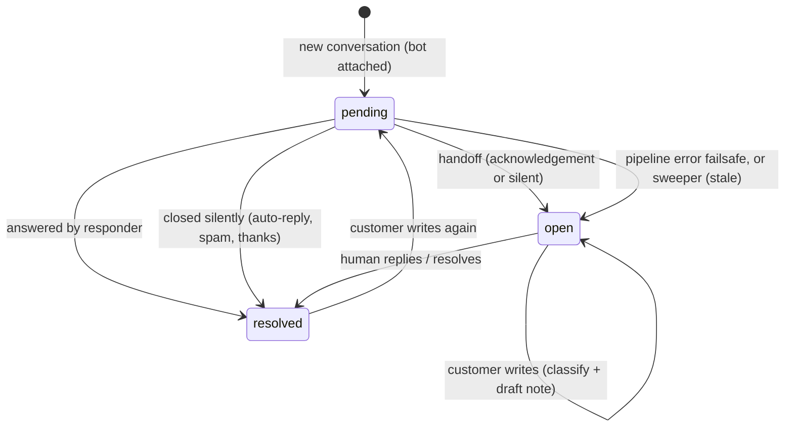
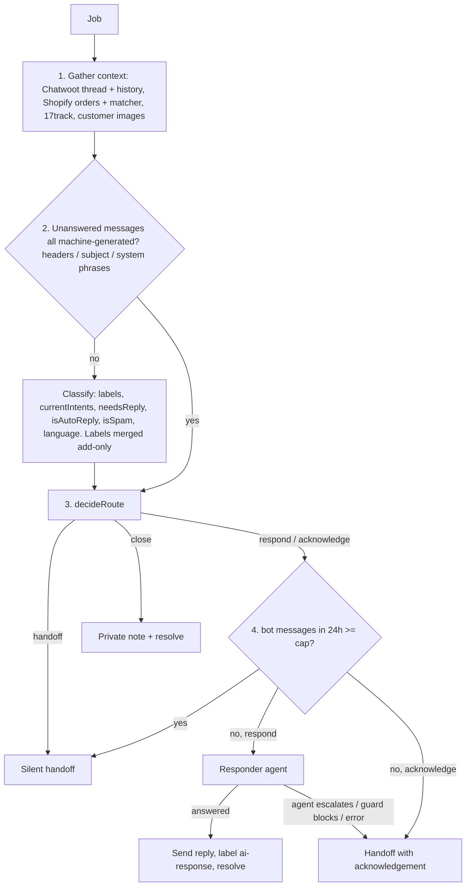

# AI AgentBot: Auto-Responder, Acknowledgements & Human Handoff

An autonomous Chatwoot AgentBot that takes first ownership of every new customer conversation. For each customer message it:
1. **answers directly** when it safely can (subscription cancellation, order status),
2. otherwise **hands off to a human** with an instant, intent-specific **acknowledgement** that asks for exactly what the agent will need, or
3. **closes silently** when nothing needs a reply (auto-replies, bounces, spam, a closing "thanks").

Orchestration: [`src/services/aiResponder.ts`](../src/services/aiResponder.ts). The design is grounded in an analysis of ~840 real conversations: see [support-research-2026-09.md](support-research-2026-09.md).

- [1. Ownership: Chatwoot status](#1-ownership-chatwoot-status)
- [2. Lifecycle](#2-lifecycle)
- [3. Entry: webhooks and the per-conversation queue](#3-entry-webhooks-and-the-per-conversation-queue)
- [4. The pipeline](#4-the-pipeline)
- [5. Routing](#5-routing)
- [6. The responder agent](#6-the-responder-agent)
- [7. Handoff and acknowledgements](#7-handoff-and-acknowledgements)
- [8. Safety nets](#8-safety-nets)
- [9. Known gaps](#9-known-gaps)
- [10. Configuration, observability & testing](#10-configuration-observability--testing)
- [11. Rollout of acknowledgements](#11-rollout-of-acknowledgements)
- [12. One-time backfill](#12-one-time-backfill)
- [13. Chatwoot setup](#13-chatwoot-setup)

---

## 1. Ownership: Chatwoot status

There is no ownership field of our own. Chatwoot's conversation status is the ownership flag:

| Status | Owner | New customer messages go to |
|--------|-------|-----------------------------|
| `pending` | **AI bot** | AgentBot webhook → queue → pipeline |
| `open` | **Human** | Draft webhook → classify + AI draft private note |
| `resolved` | Nobody | Chatwoot reopens as `pending` on the next customer message (bot attached) |

- **AI → human:** `toggle_status` → `open`.
- **AI done / nothing to answer:** `toggle_status` → `resolved`.
- **Human → AI:** no explicit handback. Resolve the conversation; the customer's next message reopens it as `pending`. Sending from the Dashboard composer resolves by default.

Chatwoot-side behaviour relied on: an inbox with an active AgentBot creates new conversations as `pending` and reopens resolved ones as `pending`; both webhooks receive every `message_created`; a bot URL that errors or exceeds ~5s flips the conversation to `open`.

> `pending` conversations live under Chatwoot's **Pending** filter, not **Open**. Agents don't see them by default.

---

## 2. Lifecycle



---

## 3. Entry: webhooks and the per-conversation queue

| | AgentBot | Draft |
|---|---|---|
| Endpoint | `POST /chatwoot/agent-bot` ([`agentBotWebhook.ts`](../src/routes/agentBotWebhook.ts)) | `POST /chatwoot` ([`chatwootWebhook.ts`](../src/routes/chatwootWebhook.ts)) |
| Secret | `?secret=` `CHATWOOT_AGENT_BOT_SECRET` | `?secret=` `CHATWOOT_WEBHOOK_SECRET` |
| Acts on status | `pending` | everything except `pending` |
| Does | enqueue an AgentBot job | skip machine-generated mail; else `postAiDraft({ classify: true })` |
| Idempotency | `wh-agentbot:<message id>`, 24h | `wh-draft:<message id>`, 24h |

Both ack `200` immediately, drop non-`message_created`, outgoing and private messages, and claim the message id in Firestore (fail-open without Firestore).

**Queue** ([`agentBotQueue.ts`](../src/services/agentBotQueue.ts)), in-process (single instance):
- **Debounce** `agentBotDebounceSeconds` (30s): another message in the same conversation restarts the wait, so a burst gets one answer.
- **Serialization:** one run per conversation at a time.
- **Status re-check** before running: `open` → a human (or an earlier run) took over, so post a draft instead; `resolved` → run only if a customer message is still unanswered; `pending` → run.

---

## 4. The pipeline

`processAgentBotConversation()`:



**Context** ([`aiDraft.ts`](../src/services/aiDraft.ts) `gatherContextWithMatching`): conversation messages, contact's other conversations, Shopify customer + orders (lookup precedence `shopify_email_link` → `shopify_customer_id` → email; matcher agent for unmatched contacts), tracking for the last 2 fulfilled orders, and customer images (fetched once, shared by every later call).

**Classifier** ([`classifier.ts`](../src/services/classifier.ts)), structured output:

| Field | Use |
|-------|-----|
| `labels` | all intents raised in the conversation; merged into Chatwoot labels (add-only, tagging only) |
| `currentIntents` | what needs handling now (latest unanswered messages + still-open requests): **routing** |
| `needsReply` | false for a pure thanks/emoji/auto-reply/spam; true when accepting an offer or answering our question |
| `isAutoReply` | out-of-office, bounces, platform notifications, our own outbound echoed back |
| `isSpam` | unsolicited pitches, commission offers, review-site/ad-platform sales, phishing |
| `language` | customer's language, used for replies and the sign-off |

Classification labels: `business`, `change-address`, `change-contact`, `sub-cancel`, `refund`, `discount-issue`, `missing-packs`, `no-country`, `not-delivered`, `order-status`, `product-defect`, `other`. Action labels (never AI-assigned): `ai-response`, `sub-cancelled-ai`, `sub-cancelled`, `refund-30/50/70/full`, `reshipped`, `changed-address`, `changed-contact`.

---

## 5. Routing

[`agentBotRouting.ts`](../src/services/agentBotRouting.ts) `decideRoute()` (pure; the prompt tester uses the same function):

| Condition (first match wins) | Route |
|---|---|
| Every unanswered customer message is machine-generated (headers/subject/phrases) | **close** |
| Classification failed | **acknowledge** (generic) |
| Classifier `isAutoReply` | **close** |
| Classifier `isSpam`, contact has no orders, intents only `business`/`other` | **close** |
| `needsReply` false (closing "thanks", reactions, nothing to answer) | **close** |
| No intents | **acknowledge** |
| All intents in `autoRespondLabels` | **respond** |
| Remaining intents all in `acknowledgeLabels` | **acknowledge** |
| Otherwise | **handoff** (silent) |
| **Override:** route is respond but the conversation started with our outbound email (proactive outreach) | **acknowledge** |
| **Override:** route is respond but no unanswered customer message has readable text (empty body, attachment only) | **acknowledge** |

Routing uses `currentIntents`, so an old `refund` label no longer blocks a later, simple "where is my order?". Mixed intents where any one needs a human go to **acknowledge**, and one message covers all of them.

---

## 6. The responder agent

Anthropic Tool Runner, `responderModel` (Sonnet 5) with adaptive thinking at `responderEffort`, `tool_choice: auto` with **one tool call per turn**, prompt [`responderPrompt.txt`](../src/config/responderPrompt.txt), plus customer images.

| Tool | When | Effect |
|---|---|---|
| `send_reply(message)` | always | stores the reply; sent after the loop (one reply per run) |
| `escalate_to_human(reason, holding_reply)` | always | records a handoff; executed after the loop; wins over any reply |
| `cancel_subscription()` | only with `sub-cancel` | cancels all active Skio subscriptions for the customer email, adds `sub-cancelled-ai` |

Playbook highlights:
- **Sub-cancel:** first request → self-service link; cancel directly when they insist, won't/can't use the website, or report the website didn't let them cancel. Never send the link twice.
- **Order status:** escalate if refunded/cancelled, unfulfilled 14+ days, no tracking movement 7+ days, 30+ days old, delivered-not-received, a repeat question, or scam/chargeback/refund talk. Otherwise describe the latest scan truthfully with its date, give carrier + tracking number when the customer can't track or it's been 10+ days, and give the 7 to 14 business day timeframe. Never "on its way" for unfulfilled orders.
- Replies in the customer's language, plain text, no em dashes, never claims to be human (sincere "are you a bot?" → escalate).

After the loop: escalation requested → handoff with acknowledgement; empty reply or guard block → handoff; reply sent → `ai-response` label, `sentReplies` record, resolve. Label/resolve failures after sending never trigger a handoff.

---

## 7. Handoff and acknowledgements

`escalateToHuman()` runs independent steps:

```
1. toggle_status → open                        (first: nothing can strand it in pending)
2. customer message (route-dependent, below)
3. escalation draft private note, headed by [AI HANDOFF]: why, intents,
   what the customer was sent, what they were asked for, agent note
```

**Customer message by `acknowledgeMode`:**

| Mode | acknowledge route / responder escalation | silent handoff |
|---|---|---|
| `off` | legacy holding reply if `holdingReplyEnabled` | nothing |
| `shadow` (default) | as `off`, **plus** the acknowledgement is generated in the background and stored in `acknowledgementShadow` (never sent) | nothing |
| `live` | the **acknowledgement** is sent; if generation fails or the guard blocks it, the agent's holding reply or the canned fallback is sent. If the model sets `shouldSend: false` (e.g. a bulk outreach thread mixing customers), nothing is sent and the note explains why | nothing |

**Acknowledgements** ([`acknowledger.ts`](../src/services/acknowledger.ts), prompt [`acknowledgePrompt.txt`](../src/config/acknowledgePrompt.txt)): structured output `{ message, askedFor[], handoffNote }`, vetted by the reply safety guard. The prompt encodes, per intent, what agents actually needed in the research (e.g. missing packs → photo of contents with pouches opened + shipping label; not-delivered → mailbox/neighbours checked, courier notice; change-address → each missing courier-ready field) and hard rules: never promise or claim an outcome, never state a cause, no policy arguments, no invented facts or links, no medical claims, customer's language.

**What the agent sees:** the conversation in **Open**, classification labels, and one private note with the handoff summary + a draft reply that knows what the customer was already sent.

**Closing silently:** a `[AI] Closed without reply: <reason>.` private note, then resolve.

---

## 8. Safety nets

| Mechanism | Where | Protects against |
|---|---|---|
| Status split + incoming/non-private filter | webhooks | double handling, replying to ourselves |
| Message-id idempotency | `claimOnce` | redeliveries |
| Debounce + per-conversation serialization + status re-check | `agentBotQueue.ts` | bursts answered N times, parallel runs, replying after a human took over |
| Machine-mail detection | [`autoReply.ts`](../src/services/autoReply.ts) | replying to out-of-office, bounces, Gmail reactions, our own echoed outreach |
| Reply cap `maxBotRepliesPer24h` | pipeline, via `sentReplies` | loops with auto-responders the detector missed |
| Outreach override | `decideRoute` | auto-answering replies to address/customs emails (bulk threads mix customers) |
| Open-first handoff, independent steps | `escalateToHuman` | handoffs stuck in `pending` |
| Pipeline failsafe | `handleAgentBotJob` | crashes leaving a conversation unseen (opens + plain draft, decision `failed`) |
| Pending sweeper | [`pendingSweeper.ts`](../src/services/pendingSweeper.ts) | missed webhooks, restarts mid-run |
| One tool call per turn | responder | confirming a cancellation before it happened |
| Reply safety guard | [`responderFormat.ts`](../src/utils/responderFormat.ts) | reasoning / scaffolding / AI disclosure leaking |

**Machine-mail signals** (no vacation wording, since real customers write "I was away"): Chatwoot's `email.auto_reply` flag; `Auto-Submitted` (≠ `no`), `X-Autoreply`, `X-Autorespond`, `Precedence: auto_reply|bulk|junk`; mailer-daemon/postmaster or `@scandigum.com` senders; auto-reply/bounce subject prefixes in ~15 languages; exact phrases near the start ("reacted via Gmail", "\*\* Address not found \*\*", one-time code notices).

**Sweeper**, every `pendingSweepIntervalMinutes` (5): `pending` conversations whose latest message is an unanswered customer message. Younger than `pendingSweepMinAgeMinutes` (10): skip. Up to `pendingSweepReplyMaxAgeHours` (24): processed by the bot. Up to `pendingSweepMaxAgeDays` (30): opened for a human with a draft (decision `swept-open`). Older: ignored. Conversations ending with our message (outreach awaiting a reply) are never touched; each customer message is swept once.

**Reply safety guard:** preamble strip, then a marker scan (deliberation, third-person customer, playbook references, pipeline vocabulary, agent notes, prompt scaffolding, AI self-disclosure, tool talk); anything still flagged is never sent. Sign-off localized to the customer's language. Note: markers are English-only.

---

## 9. Known gaps

1. **Restart during the debounce window** loses queued jobs until the sweeper picks them up (10+ minutes later).
2. **Duplicate conversations** from the same contact (email + contact form, repeat chasers) are handled independently; nothing links them yet.
3. **Only one inbox appears bot-routed:** Facebook and replies into the Klaviyo sender inbox never reached the AgentBot in the research sample. Attach the bot to those inboxes in Chatwoot if they should be covered.
4. **Guard markers are English-only**, so leaks in other languages rely on the prompt.
5. **No knowledge base:** product/pre-sale questions (ingredients, flavours, shipping times) are acknowledged rather than answered.
6. **History overwritten:** `agentBotDecisions` and `classifications` keep the latest doc per conversation only.
7. **Persona split:** bot messages are signed "Scandi Support Team", humans sign "Andrew".

---

## 10. Configuration, observability & testing

All live-editable in the [Admin Dashboard](admin-dashboard.md), falling back to code defaults ([`aiDefaults.ts`](../src/config/aiDefaults.ts)).

| Setting | Default | Effect |
|---|---|---|
| `autoRespondLabels` | `sub-cancel, order-status, other` | intents the responder handles |
| `acknowledgeLabels` | all classification labels | intents that get an acknowledgement on handoff |
| `acknowledgeMode` | `shadow` | `off` / `shadow` / `live` (see §7) |
| `holdingReplyEnabled` | `AGENT_BOT_HOLDING_REPLY` | legacy holding reply when not `live` |
| `acknowledgeSystemPrompt` / `acknowledgeModel` / `acknowledgeEffort` / `acknowledgeMaxTokens` | `acknowledgePrompt.txt` / Sonnet 5 / `medium` / 4000 | acknowledgements |
| `responderSystemPrompt` / `responderModel` / `responderEffort` | `responderPrompt.txt` / Sonnet 5 / `high` | responder |
| `classifierSystemPrompt` / `classifierModel` / `classifierEffort` | `aiDefaults.ts` / Sonnet 5 / `medium` | classifier |
| `agentBotDebounceSeconds` | 30 | burst window |
| `maxBotRepliesPer24h` | 3 | per-conversation cap on bot messages |
| `pendingSweepEnabled`, `pendingSweepIntervalMinutes`, `pendingSweepMinAgeMinutes`, `pendingSweepReplyMaxAgeHours`, `pendingSweepMaxAgeDays` | true, 5, 10, 24, 30 | sweeper |

**Kill switch:** detach the AgentBot from the inbox. `acknowledgeMode: off` stops acknowledgements only.

| Question | Where |
|---|---|
| What did the bot decide? | `agentBotDecisions/<id>`: `route`, `action` (responded / escalated / handed-off / closed / skipped / failed / swept-open), `reason`, `intents` |
| Why these intents? | `classifications/<id>` (all classifier fields + reasoning) |
| What would acknowledgements say? | `acknowledgementShadow` (shadow mode) |
| What did the bot send? | `sentReplies` (`agent-bot`, `agent-bot-holding`, `dashboard`) |
| Guard interventions | `responderGuardEvents` |
| Spend | `aiUsage` |

**Testing**

```bash
npx tsx src/scripts/verifyAgentBotRouting.ts   # routing + machine-mail detection (no credentials)
npx tsx src/scripts/verifyResponderGuard.ts    # reply safety guard (no credentials)
```

**Quality review** ([`reviewAgentBot.ts`](../src/scripts/reviewAgentBot.ts)): grades each conversation with Claude Opus 5 (route and intents correct? message good/poor/harmful? issues by severity and category, suggested fix) and writes a markdown + JSON report to `~/agentbot-reviews` (outside the repo: it contains customer data). Read-only.

```bash
npm run review:agentbot                     # every live decision in the last 24h
npm run review:agentbot -- --hours=48 --limit=100
npm run review:agentbot -- --replay --ids=11264,11410 \
  --overrides='{"acknowledgeMode":"live"}'  # pre-launch: replay with unsaved config
```

The **Prompt Tester** replays a real conversation with no side effects: `classifier`, `responder` (with routing), `acknowledge` (routing + the exact acknowledgement, asked-for list and handoff note) and `draft`. Bot kinds replay the conversation **as of the customer's latest message**, so already-answered threads show what the bot would have done at the time.

---

## 11. Rollout of acknowledgements

1. **Shadow** (default after deploy): routing, silent closes, cap, sweeper and queue are live; acknowledgements are generated and stored in `acknowledgementShadow` only.
2. Review a sample of shadow acknowledgements (and Prompt Tester runs per intent); tune `acknowledgePrompt.txt` from the Admin Dashboard.
3. Set `acknowledgeMode: live`. Consider removing `other` from `autoRespondLabels` then, since the responder escalates those anyway and the acknowledgement handles them better.
4. Watch `agentBotDecisions`, `sentReplies`, `responderGuardEvents` and reopen rates.

---

## 12. One-time backfill

```bash
npm run backfill -- --test --dry-run   # preview the latest 10 (no changes)
npm run backfill -- --limit=50         # process the latest 50 for real
```

Only `open` conversations; responds only when routed to the responder with every intent in `backfillAutoRespondLabels` (`sub-cancel`, `order-status`); never escalates, acknowledges or drafts. Classification labels are still written (except `--dry-run`).

---

## 13. Chatwoot setup

1. Create labels: `ai-response`, `sub-cancelled-ai`, `sub-cancelled`, and the classification labels.
2. **Settings → Bots → Add Agent Bot**: `https://<domain>/chatwoot/agent-bot?secret=<CHATWOOT_AGENT_BOT_SECRET>`.
3. Connect the bot to every inbox it should own.
4. Keep the account `message_created` webhook: `https://<domain>/chatwoot?secret=<CHATWOOT_WEBHOOK_SECRET>`.
5. Make sure agents know the **Pending** tab exists.
